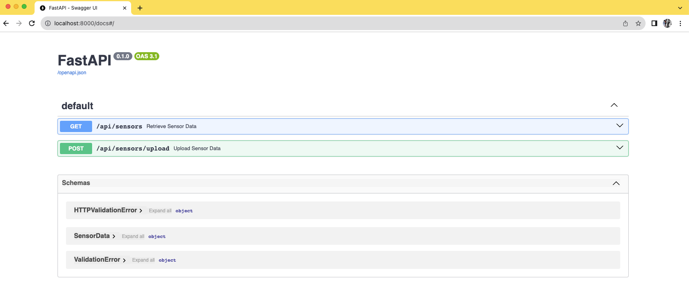

# FluidSense 💧

FluidSense is a Micro python script to read, filter, and manipulate sensor data from CSV files, based on this this Kaggle dataset: [Dataset (pump-sensor-data)](https://www.kaggle.com/datasets/nphantawee/pump-sensor-data).


### Features

- Load CSV Files: Easily load pump-sensor-data, dataset provided by Kaggle.
- Custom Filters: No harcoded values, filtering parameters can be update easily.
- DataFrane Management: Utilizes Pandas Dataframes for an optimal performance.
- FastAPI Endpoints: Simple endpoints with documentation generated by FASTAPI.

### Stack libraries:

- Python 3.10+: For core functionalities.
- Pandas: For efficient data handling and manipulation.
- FastAPI: For creating and handling API endpoints.
- Pydantic: For DataModel Validations.

### Structure:
    ├── csv_data
    │   └── sensor.csv
    ├── main.py
    ├── requirements.txt
    └── sensor_lib.py

### Dataframe Structure:

```sh
sensor_lib:          Fecha      Hora     Sensor   Medicion      Estado
0    2018-04-18  04:41:00  sensor_47  29.513890  RECOVERING
1    2018-04-18  04:42:00  sensor_47  29.513890  RECOVERING
2    2018-04-18  04:43:00  sensor_47  29.224540  RECOVERING
3    2018-04-18  04:44:00  sensor_47  29.224537  RECOVERING
4    2018-04-18  04:45:00  sensor_47  29.224537  RECOVERING
..          ...       ...        ...        ...         ...
299  2018-04-19  10:34:00  sensor_07  21.202260  RECOVERING
300  2018-04-19  10:35:00  sensor_07  21.129920  RECOVERING
301  2018-04-19  10:36:00  sensor_07  21.129920  RECOVERING
302  2018-04-18  04:41:00  sensor_47  29.513890  RECOVERING
303  2018-04-18  04:42:00  sensor_47  29.513890  RECOVERING

[304 rows x 5 columns]
```


#### Classes:


**Config**: Defines the default configuration parameters, including paths,  filtering values: date ranges, and sensor values.

**class SensorData**:  A Pydantic model for validating and handling sensor data.

**class SensorDataSet**: Encapsulates the logic for loading and filtering CSV data, and provides methods to get and add more information throught Dataframe.

#### Example Usage
```python
config = Config()
sensor_data = SensorDataSet(config)
data = sensor_data.get_data()
```

## Installation:
Python: Version 3.10 or higher is required to run this project.
#TODO I didn't have time to test this with another Python version or add Tox and a complete test suite as I would like..

#### Virtual Environment (Recommended)
```sh
> pyenv virtualenv 3.10.0 fluidsense-env
```
#### Install requirements.txt and run main.py
```sh
# Install requirements
> pip install -r requirements.txt
# Run main.py
> python main.py

INFO:     Started server process [82427]
INFO:     Waiting for application startup.
INFO:     Application startup complete.
INFO:     Uvicorn running on http://0.0.0.0:8000 (Press CTRL+C to quit)

```

#### 🚀 Finally, go to [http://localhost:8000/docs](http://localhost:8000/docs), and you can start playing with this micro app 💧.



